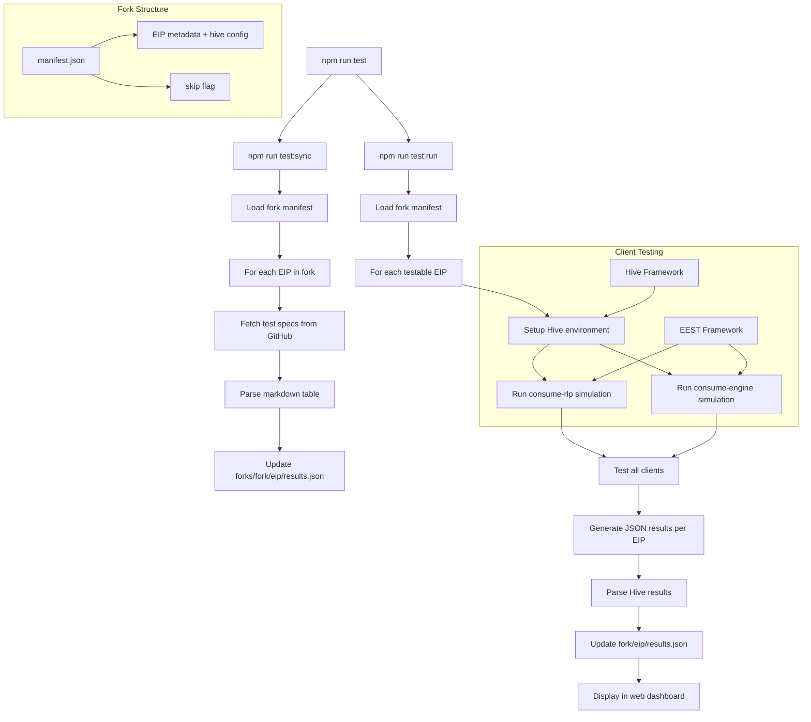

# Technical Summary

## Why

Butterfly provides concrete, testable milestones for EIP implementation across Ethereum execution clients. This approach offers transparent tracking of objective progress across network upgrade forks, making adoption easier to follow for both core developers and the broader community.

## The testing infrastructure

The tracker uses two testing frameworks that handle Ethereum client validation. The Ethereum Execution Spec Tests (EEST) framework generates standardized test cases. Written in Python, EEST creates JSON test fixtures that define expected behavior for protocol features. These tests use transition tools from various clients to create reference implementations, allowing all clients to validate against the same test cases.

Hive provides a common interface for testing across different client implementations. It uses "simulators" that launch clients and execute test logic against them.

## How it works

Running `npm run test` executes a two-phase process across all testable EIPs in a fork. The command runs sync and test phases sequentially, ensuring the latest test specifications are used before execution begins.

### Phase 1: Test specification sync

The first phase, `npm run test:sync`, loads the fork manifest and iterates through all EIPs. For each EIP, it fetches test case specifications from the GitHub URL defined in the manifest's `testCases` field. The `sync-test-cases.ts` script parses structured markdown tables containing test definitions (function names, goals, setup, expectations). Test cases are initialized with "pending" status and written to `src/data/forks/{fork}/{eip}/results.json`.

EIPs marked with `skip: true` in the manifest are automatically excluded from syncing.

### Phase 2: Test execution

The second phase, `npm run test:run`, orchestrates Hive testing across all testable EIPs in the fork. The `run-integration-tests.ts` script loads the fork manifest and processes each non-skipped EIP that has hive configuration.

For each EIP, the system executes two distinct simulation types sequentially:
- **consume-rlp**: Tests how clients handle RLP import of blocks
- **consume-engine**: Validates Engine API integration with consensus layer

Each simulation launches containerized versions of configured Ethereum clients using EIP-specific configurations:
- Client builds are specified in `src/data/forks/{fork}/{eip}/clients.yml`
- Hive configuration (fixtures, branch, test filter) comes from the manifest's `hive` field
- Results are organized in `.hive/{simulation}/{eip}/` directories

The test filter from the manifest ensures only relevant tests run for each EIP, while global parallelism settings optimize execution time.

## Data processing and results

After each simulation completes, the `parse-hive-results.ts` script processes the raw Hive output. It accepts fork and EIP parameters to locate the correct result files and update the appropriate `results.json` file.

The system maintains data at multiple levels:
- **Fork level**: `src/data/forks/{fork}/manifest.json` defines available EIPs
- **EIP level**: `src/data/forks/{fork}/{eip}/results.json` contains test results per EIP
- **Global**: `src/data/clients.json` tracks shared client metadata (versions, GitHub repos)

## Technical resources

The system builds on established Ethereum testing infrastructure:
- [Hive testing framework](https://github.com/ethereum/hive/blob/master/docs/overview.md) - Cross-client testing documentation
- [Execution Spec Tests repository](https://github.com/ethereum/execution-spec-tests) - Test case development
- [Running EEST tests with Hive](https://eest.ethereum.org/main/running_tests/hive/) - Framework integration guide
- [EIP-7928 test cases](https://github.com/ethereum/execution-spec-tests/blob/main/tests/amsterdam/eip7928_block_level_access_lists/test_cases.md) - Example test specifications
